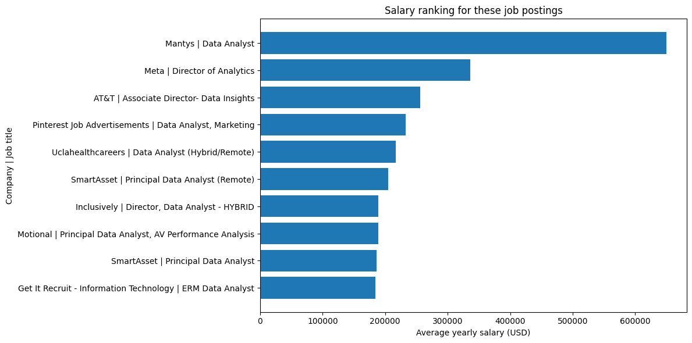
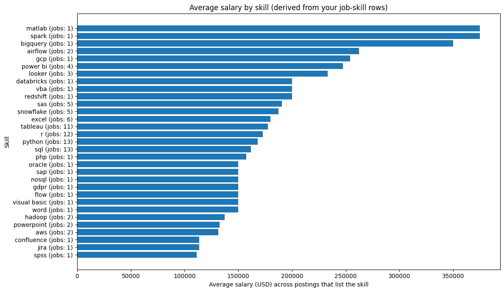

# Introduction
This project explores top-paying jobs, in-demand skills, and demand vs. salary in data analytics.

Check out my SQL queries here: [project_sql folder](/project_sql/) 

# Background
This project was an exercise in SQL, and the exploration of Data Analytics both from hands-on practice and real-world job market observation. 

The data I used for this projcet comes from [SQL Course](https://lukebarousse.com/sql)

### The questions I wanted to answer through my SQL queries were:

1. What are the top-paying data analyst jobs?
2. What skills are required for these jobs?
3. What skills are most in demand for data analysts?
4. Which skills are associated with higher salaries?
5. What are the most optimal skills to learn?

# Tools I Used
- **SQL:** The bakbone of my analysis, allowing me to query the database and unearth critical insights.
- **PostgreSQL:** The chosen database management system, ideal for handling the job posting data.
- **Visual Studio Code:** My go-to for database management and executing SQL queries.
- **Git & GitHub:** Essential for version control and sharing my SQL scripts and analysis, ensuring collaboration and project tracking. 
# The Analysis
Each query for this project aimed at investigating specific aspects of the data analyst job market. Here's how I approached each question:

### 1. Top Paying Data Analyst Jobs
To Identify the highest-paying roles, I filtered data analyst positions by averatge yearly salary and location, focusing on remote jobs. This query highlights the high paying opportunities in the field.

```sql
SELECT
    job_id,
    job_title,
    job_location,
    job_schedule_type,
    salary_year_avg,
    job_posted_date,
    name company_name
FROM
    job_postings_fact
LEFT JOIN company_dim ON job_postings_fact.company_id = company_dim.company_id
WHERE
    job_title_short = 'Data Analyst' AND
    job_location = 'Anywhere' AND
    salary_year_avg IS NOT NULL
ORDER BY
    salary_year_avg DESC
LIMIT 10;
```
Here's the breakdown of the top data analyst jobs:
- **Wide Salary Range:** Top 10 paying data analyst roles span from $184,000 to $650,000, indicating significant salary potential in the field.
- **Diverse Employers:** Companies like SmartAsset, Meta, and AT&T are among those offering high salaries, showing a broad interest across different industries.
- **Job Title Variety:** There's a high diversity in job titles, from Data Analyst to Director of Analytics, reflecting varied roles and specializations within data analytics.


*Bar graph visualizing the salary for the top 10 salaries for data analysts; ChatGPT generated this graph from my SQL query results*

### 2. Skills for Top Paying Jobs
To understand what skills are required for the top-paying jobs, I joined the jop postings with the skills data, providing insights into what employers value for high- compensation roles.

```sql
WITH top_paying_jobs AS (
    SELECT
        job_id,
        job_title,
        salary_year_avg,
        name company_name
    FROM
        job_postings_fact
    LEFT JOIN company_dim ON job_postings_fact.company_id = company_dim.company_id
    WHERE
        job_title_short = 'Data Analyst' AND
        job_location = 'Austin, TX' AND
        salary_year_avg IS NOT NULL
    ORDER BY
        salary_year_avg DESC
    LIMIT 20
)

SELECT 
    top_paying_jobs.*,
    skills
FROM top_paying_jobs
INNER JOIN skills_job_dim ON top_paying_jobs.job_id = skills_job_dim.job_id
INNER JOIN skills_dim ON skills_job_dim.skill_id = skills_dim.skill_id
ORDER BY
    salary_year_avg DESC;
```

*Bar graph visualizing the job skills for the top 20 salaries for data analysts in Austin, TX; ChatGPT generated this graph from my SQL query results*

Here's the breakdown of the most demanded skills for the top 20 highest paying data analyst jobs:
- **SQL** is tied for the lead with 13 jobs.
- **Python** is also tied for the lead with 13 jobs.
- **R** is close behind with 12 jobs.
- **Tableau** is also highly sought after with 11 jobs, with a count of six. 
Other notable skills by frequency include **Excel (6)**, **Snowflake (5)**, and **SAS (5)**, followed by **Power BI (4)** and **Looker (3)**.

### 3. In-Demand Skills for Data Analysts
This query helped identify the skills most frequently requested in job postings, directing focus to areas with high demand.

```sql
SELECT
    skills,
    COUNT(skills_job_dim.job_id) AS demand_count
FROM job_postings_fact
INNER JOIN skills_job_dim ON job_postings_fact.job_id = skills_job_dim.job_id
INNER JOIN skills_dim ON skills_job_dim.skill_id = skills_dim.skill_id
WHERE
    job_title_short = 'Data Analyst' AND
    job_location = 'Austin, TX'
GROUP BY
    skills
ORDER BY
    demand_count DESC
LIMIT 10;
```
| skills      | demand_count |
|------------|--------------:|
| sql        |          1028 |
| excel      |           829 |
| python     |           699 |
| tableau    |           680 |
| sas        |           410 |
| r          |           318 |
| power bi   |           251 |
| word       |           227 |
| powerpoint |           148 |
| oracle     |           135 |

Here's the breakdown of the most demanded skills for data analysts in Austin, TX. 
-**Foundational analysis skills dominate demand:** **SQL (1028)** and **Excel (829)** are the clear leaders, reinforcing that querying, cleaning, and spreadsheet-based analysis are still the most commonly requested core skills.

- **Technical analysis and BI are close behind:** **Python (699)** and **Tableau (680)** are nearly tied, showing strong demand for analysts who can both program and communicate insights through dashboards. **Power BI (251)** also appears frequently, but at a lower rate than Tableau in this dataset.

- **Legacy and office-suite skills still matter:** **SAS (410)** and **R (318)** remain meaningful requirements in a sizable chunk of postings. On the business communication side, **Word (227)** and **PowerPoint (148)** show up often enough to signal that documentation and presentation are part of the job, not optional. **Oracle (135)** appears, but it is the least demanded skill in this top list.


### 4. Skills Based on Salary
Exploring the average salaries associated with different skills revealed which skills are the highest paying.

```sql
SELECT
    skills,
    ROUND(AVG(salary_year_avg), 0) AS avg_salary
FROM job_postings_fact
INNER JOIN skills_job_dim ON job_postings_fact.job_id = skills_job_dim.job_id
INNER JOIN skills_dim ON skills_job_dim.skill_id = skills_dim.skill_id
WHERE
    job_title_short = 'Data Analyst'
    AND salary_year_avg IS NOT NULL
    AND job_location = 'Austin, TX'
GROUP BY
    skills
ORDER BY
    avg_salary DESC
LIMIT 5;
```
| skills   | avg_salary |
|---------|-----------:|
| matlab  |     375000 |
| airflow |     262500 |
| spark   |     222208 |
| bigquery|     210000 |
| redshift|     200000 |


Here's a breakdown of the results for top paying skills for Data Analysts in Austin, TX:
- **Highest-Paying Technical Computing Skill:** MATLAB leads this list with an average salary of $375,000, suggesting the highest-paying analyst roles here are tied to specialized quantitative, engineering, or research-heavy work.
- **Data Engineering and Pipeline Skills:** Airflow is the second-highest at $262,500, pointing to a strong premium for analysts who can orchestrate workflows and contribute to pipeline automation, not just reporting.
- **Big Data Processing and Analytics at Scale:** Spark shows an average salary of $222,208, indicating higher compensation for analysts working with large-scale data processing and distributed systems.
- **Cloud Data Warehousing Skills:** BigQuery and Redshift come in at $210,000 and $200,000 respectively, reinforcing that analysts who can operate in cloud warehouse ecosystems tend to land higher-paying roles.


### 5. Most Optimal Skills to Learn
Combining insights from demand and salary data, this query aimed to pinpoint skills that are both in high demand and have high salaries, offering a strategic focus for skill development.

```sql
SELECT
    skills_dim.skill_id,
    skills_dim.skills,
    COUNT(skills_job_dim.job_id) AS demand_count,
    ROUND(AVG(job_postings_fact.salary_year_avg),0) AS avg_salary
FROM
    job_postings_fact
INNER JOIN skills_job_dim ON job_postings_fact.job_id = skills_job_dim.job_id
INNER JOIN skills_dim ON skills_job_dim.skill_id = skills_dim.skill_id
WHERE
    job_title_short = 'Data Analyst'
    AND salary_year_avg IS NOT NULL
    AND job_location = 'Austin, TX'
GROUP BY
    skills_dim.skill_id
HAVING
    COUNT(skills_job_dim.job_id) > 10
ORDER BY
    avg_salary DESC,
    demand_count DESC
LIMIT 5;
```
| skill_id | skills    | demand_count | avg_salary |
|---------:|-----------|-------------:|-----------:|
|        5 | r         |           21 |     135499 |
|      182 | tableau   |           27 |     115324 |
|      183 | power bi  |           15 |     115030 |
|        1 | python    |           35 |     112188 |
|        0 | sql       |           49 |     100092 |


Here's a breakdown of the most optimal skills for Data Analytics in Austin, TX.

- **High-Demand Programming Languages:** SQL and Python stand out for their high demand, with demand counts of 49 and 35 respectively. Their average salaries are $112,188 for Python and $100,092 for SQL, suggesting these are core, baseline requirements for many roles, with pay varying by seniority and scope rather than the skill alone.
- **Business Intelligence and Visualization Tools:** Tableau and Power BI show strong value in analytics workflows. Tableau has a demand count of 27 with an average salary of $115,324, while Power BI has a demand count of 15 with an average salary of $115,030. This reinforces that visualization and BI skills are consistently tied to solid compensation.
- **Database Technologies:** R has the highest average salary here at $135,499, with a demand count of 21. That combination points to a skill that is less requested than SQL or Python, but tends to appear in higher-paying postings when it is required.


# What I Learned
After looking at skill demand in Austin and the skill mix inside the highest-paying postings, a few patterns are loud and clear:

 -**Foundations Still Win the Volume Game:** SQL (1028) and Excel (829) are the everyday workhorses. Right behind them, Python (699) and Tableau (680) show that modern analyst roles expect both technical analysis and clean storytelling. SAS (410), R (318), and Power BI (251) still show up often enough to matter.

- **Top Pay Still Expects the Core Stack:** Even in the highest-paying slice, the basics do not disappear. SQL (13 jobs) and Python (13 jobs) are tied at the top, with R (12 jobs) and Tableau (11 jobs) close behind. High salary does not mean niche-only, it usually means strong fundamentals plus broader scope.

- **The Salary Premium Lives in Engineering-Adjacent Tools:** The biggest average salaries in your top-paying skill list come from tools that signal scale and pipelines: MATLAB ($375,000), Airflow ($262,500), Spark ($222,208), BigQuery ($210,000), and Redshift ($200,000). These are the skills that push a role from analysis into automation, infrastructure, and production-grade data work.

# Conclusions
### Insights

1. **Foundation Skills Drive the Market:** In Austin, TX, **SQL (1028)** and **Excel (829)** dominate demand, confirming that core querying and spreadsheet analysis are still the most requested baseline skills.

2. **Technical + Storytelling Stack Is the Sweet Spot:** **Python (699)** and **Tableau (680)** are nearly tied in demand, showing that employers want analysts who can both build analysis and communicate it clearly through dashboards and reporting.

3. **Top Paying Jobs Still Require the Core:** In the highest paying job sample, **SQL (13 jobs)** and **Python (13 jobs)** are tied for the most frequent skills, with **R (12 jobs)** and **Tableau (11 jobs)** close behind. High pay roles still expect the fundamentals.

4. **Engineering Adjacent Skills Correlate With Higher Salaries:** The highest average salaries are tied to tools that suggest scale and pipelines: **MATLAB ($375,000)**, **Airflow ($262,500)**, **Spark ($222,208)**, **BigQuery ($210,000)**, and **Redshift ($200,000)**.

5. **BI Tools Stay Valuable Across the Board:** Visualization tools show both frequency and strong pay outcomes, with **Tableau (11 jobs)** and **Power BI (4 jobs)** appearing repeatedly in top paying postings, reinforcing BI as a reliable skill investment.

### Closing Thoughts

This project helped me connect the dots between what the Austin data analyst market demands most and what the highest paying roles tend to require. The demand data confirms that SQL and Excel remain the baseline for employability, while Python and BI tools like Tableau signal the ability to deliver analysis with real business impact. On the compensation side, the highest pay is consistently tied to roles that lean beyond reporting into scale and infrastructure, with pipeline and big data tools like Airflow, Spark, BigQuery, and Redshift showing strong salary signals.

Going forward, the clearest path is to stay sharp on the core stack while deliberately adding engineering adjacent skills that increase leverage and scope. By prioritizing SQL, Python, and visualization, then layering in workflow orchestration and cloud warehousing, I can position myself for roles that are both easier to land and more likely to pay at the top end of the market.
